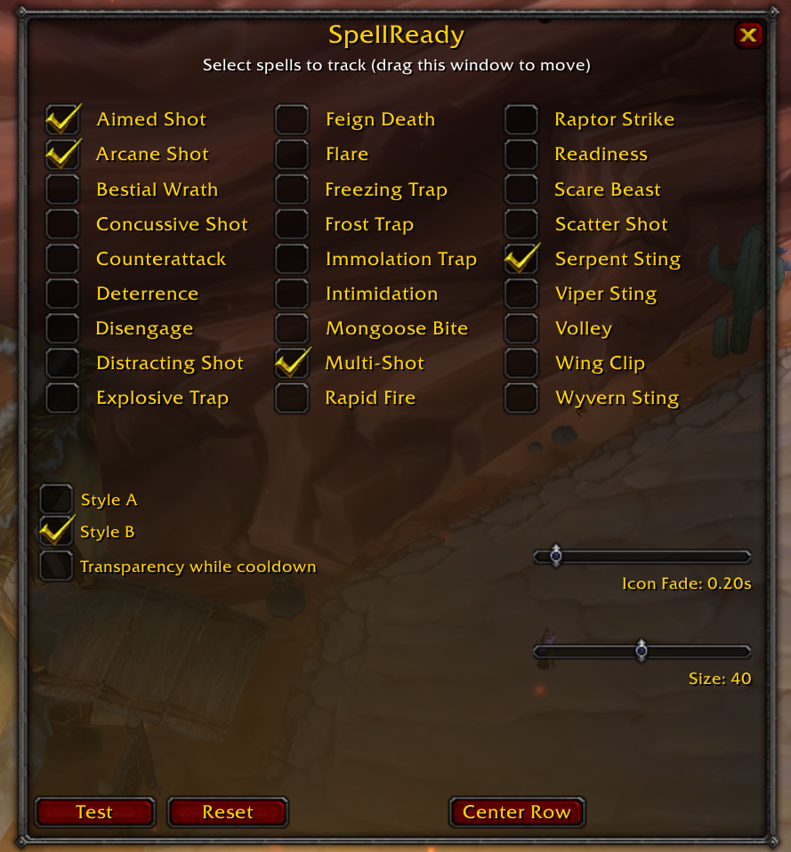
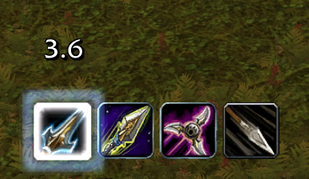

## SpellReady (Turtle WoW)

SpellReady is a hunter cooldown and proc tracker for Turtle WoW.

## Install

Copy `SpellReadyTurtle` to:
`World of Warcraft\Interface\AddOns\`

Then start the game and enable the addon.

## Commands

- `/srt`
- `/spellready`

## What It Does

- `Style A`: centered ready pulse
- `Style B`: persistent spell bar with cooldown and proc highlights
- `Lock and Load`: white timer above `Aimed Shot`, turns red in the last 3 seconds
- `Ammo procs`: highlights the matching spell on the bar

Ammo proc mapping:
- `Explosive Ammunition` -> `Multi-Shot`
- `Enchanted Ammunition` -> `Arcane Shot`
- `Poisonous Ammunition` -> `Serpent Sting`

## Basic Use

1. Open the menu with `/srt`.
2. Choose `Style A` or `Style B`.
3. Enable the spells you want to track.
4. Use `Test` to preview the visuals.
5. Adjust size, fade, font, and position.
6. Lock the position when finished.

## Troubleshooting

If `/srt` does nothing:

1. Type `/reload`.
2. Try `/srt` again.
3. If it still fails, run `/console scriptErrors 1`.
4. Reload and check the error message.

## Latest Menu

Latest `/srt` menu:

## Demo GIF

How it works in-game:

## More Screenshots

Proc highlight example:

